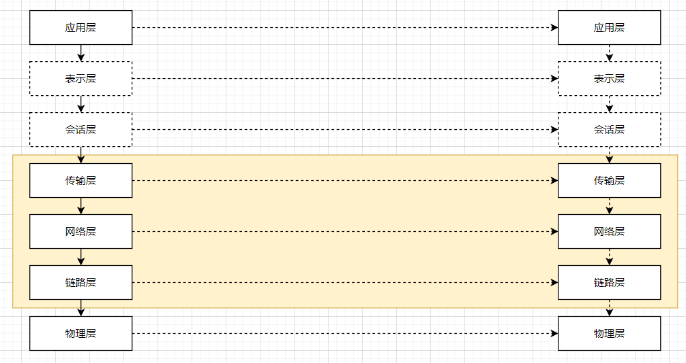

### 网络模型

1. 网络有七层协议和四层协议之说。七层协议属于理论基础，目前的实际应用均为四层协议：

* 其中四层协议裁剪掉了表示层和会话层
* 黄色部分的传输层，网络层，链路层均为内核态(意思就是由操作系统的内核来管理)。 应用层则由应用程序里处理。
* 当发生网络通信的时候，信息传输路径为：应用层(源)->传输层(源)->网络层(源)->链路层(源)->物理层(源)  ===>>> 物理层(目)-> 链路层(目)->网络层(目)->传输层(目)->应用层(目)。三次握手，四次分手同样也是这个过程(不包括应用层)
